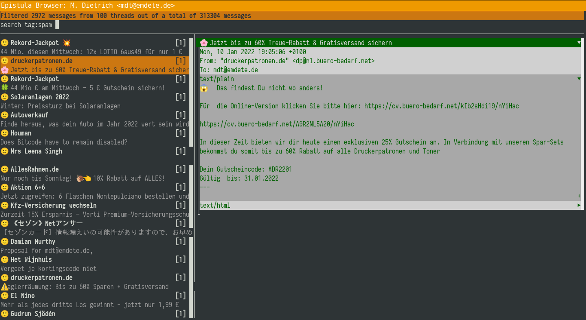

Epistula
==

Itching
--

> Every open source project begins with an itching

this is about a huge itchy reaction on the current state of email processing, code production explosion and memory consumption inflation i had. it was an terrible itching.

if you want to code one of the most hip IDEs is fact based on a browser. it eats memory, contains millions of code lines, installs 330MB for an editor. same goes for a chat client. so when i looked over the alternatives for the chat client you had the choice between various GUI projects which more or less did not implement the desired features or where based on QT. only (gomuks)[https://github.com/tulir/gomuks] worked for me out of the box. incredible well even. while that one was based on console out. it's not even a GUI but a CUI. still it displays images (or thumbnails of that). it's written in (go)[https://go.dev/] and uses tcell.

i wondered if there is an email MUA with a similar concept. i did not find any. so i started my own.

Decisions
--

I need four areas: an area to show a mail thread, an area to list the mail threads, an area to enter a query term, an area to show some status information.

I code in Go.

I decided to have no focus control over widgets. the keys tell, which area will use them. page up/down navigates emails, cursor up/down navigates thread list, cursor left/right and chars work on the query term (more keys to come). Mouse clicks will routed by area.

I decided to have no fancy model view controler stuff or the like. no layout manager, just hardcoded positions. visualisation merges with function, no widget abstraction. everything is based on putting chars or strings onto the screen.

I decided to use the components

- (tcell)[github.com/gdamore/tcell/v2] to do CUI
- (notmuch)[github.com/zenhack/go.notmuch] to query mails
- (gpgme)[github.com/proglottis/gpgme] to decode mails
- (gmime)[github.com/sendgrid/go-gmime] to parse mails

So mainly the project is just a driver for those fine libraries.

Preconditions
--

While i was a big fan of rxvt i switched to gnome-terminal recently because it has better support for all the fancy stuff tcell supports like more colors, mouse reporting, double width characters and so on.

I use the font Iosevka which gives proper, sharp letters and contains unicode special chars.

Warning
--

This is POC code! It looks like spaghetti but that is intended as i am learning how i want my MUA to behave.

